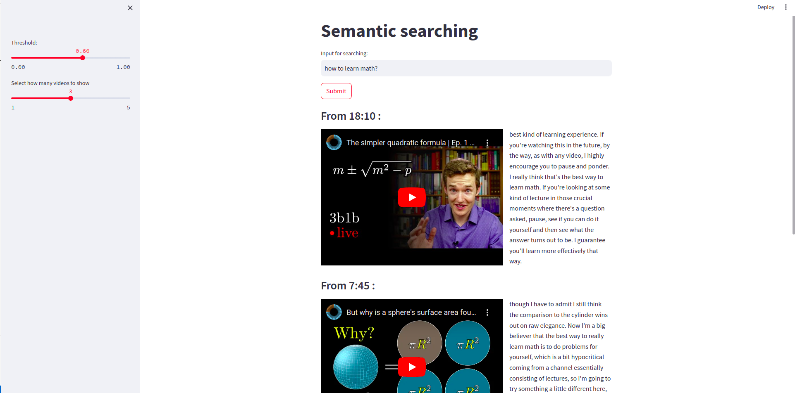

# Semantic Search

## Table of Contents

- [Introduction](#introduction)
- [Installation](#installation)
  - [Cloud](#cloud)
  - [Locally](#locally)
- [App Preview](#app-preview)


## Introduction

This app provides a demonstration of semantic searching in 3BlueBrowns math videos. Users can input questions such as "How to learn math?" and receive videos where the topic is discussed.

## Installation

### Cloud

You can access the app online at: [Semantic Search - 3BlueBrown](https://semanticsearch-3bluebrown.streamlit.app/)

### Locally

To run the app locally, follow these steps:

1. Clone the repository to your local computer:
    ```bash
    git clone git@github.com:maxiew123/semantic_search.git
    ```

2. Create a virtual environment using venv or conda:

    - **Using venv:**
      ```bash
      python3.9 -m venv newenv
      ```
  
    - **Using conda:**
      ```bash
      conda create -n newenv python=3.9
      ```

3. Activate the environment and install requirements:
    ```bash
    # Activate the environment (choose one command based on your environment)
    # For venv:
    source newenv/bin/activate
    # For conda:
    conda activate newenv

    # Install dependencies
    pip install -r requirements.txt
    ```

4. Run the app:
    ```bash
    streamlit run app.py
    ```

This will start the app locally, and you can access it in your web browser!


## App Preview




